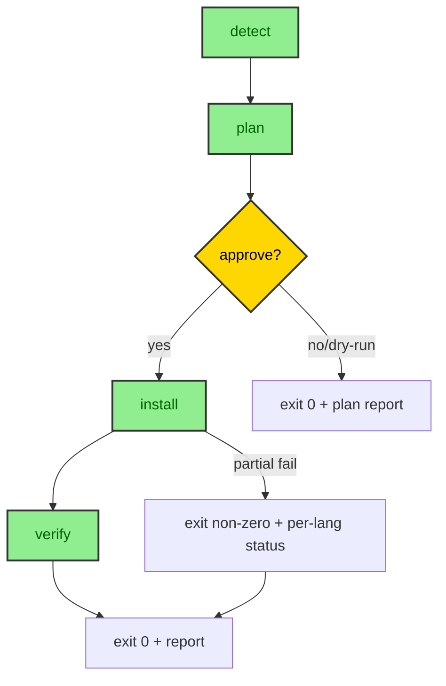

# checkchange prepare-repo Design

**Date:** 2026-09-21  
**Status:** Approved — single-plan scope, no TBD/TODO, no contradictions  
**Scope:** New `prepare-repo` subcommand that detects project stack, verifies/installs missing test/coverage/complexity infrastructure per detected stack, operator-approval gated. Agent callers present plain-english what+why first and wait.

---

## §G Goal & Constraints

### Goal

`checkchange prepare-repo` verifies and installs missing test/coverage/complexity infrastructure per detected stack (Node/Python/mixed/unknown), operator-approval gated. Agent callers present plain-english what+why first and wait.

### Constraints (Done)

| Constraint | Resolution |
|------------|------------|
| **Boundary** | No source edits, no full test runs beyond coverage probe, no upgrades, no commits, no CI writes; installs + checkchange config only |
| **Lock** | Provider registry + testRunners single source; forbidden sudo/global installs/silent install |
| **Surface** | `prepare-repo [--dry-run] [--json] [--yes]` kebab-case |
| **Edge** | Partial failure → non-zero exit, per-language status, repo usable, no half-written config |
| **Resolved** | Lockfile precedence (pnpm-lock>yarn.lock>npm); create `.venv` via `python3 -m venv` never system pip; system tools out of scope + notify operator why + what-to-do |

### Exit Condition

Exit 0 + machine report per language (stack, each dep present/installed/skipped/unfixable, artifact paths) + follow-up `doctor` all-ok.

---

## §1 Architecture: 5 Phases

### New File

**`src/providers/prepare.ts`** — 5 phases: detect → plan → approve → install → verify



### Phase Details

#### 1. detect (reuse `resolveRunner`)

- Input: `cwd`
- Reuses existing `resolveRunner(cwd)` from `src/cli.ts:192` (detects pnpm/yarn/npm/poetry/pip/uv/make/cargo)
- Returns: `DetectedStack` — `{ languages: string[], runners: RunnerInfo[], lockfiles: LockfileInfo[] }`
- RunnerInfo: `{ type: 'npm'|'pnpm'|'yarn'|'pip'|'uv'|'poetry'|'cargo'|'make', lockfilePath: string, version?: string }`
- LockfileInfo: `{ path: string, type: string, precedence: number }` (precedence: pnpm-lock=1, yarn=2, package-lock=3, poetry=4, requirements=5, Cargo=6)

#### 2. plan

- Input: `DetectedStack`
- Output: `InstallPlan` per language:

```typescript
interface InstallPlan {
  language: 'typescript' | 'python' | 'unknown';
  stack: string;           // e.g. "Node (pnpm)", "Python (uv)"
  actions: Action[];
  configUpdates: ConfigUpdate[];
}

interface Action {
  type: 'install' | 'create-venv' | 'install-lockfile' | 'verify-tool';
  description: string;     // plain english: "Install vitest via pnpm install -D"
  command: string[];       // argv for spawn (no shell)
  cwd: string;
  allowlistKey: string;    // maps to allowlist entry
  required: boolean;       // false = optional, failure → unfixable not error
}

interface ConfigUpdate {
  type: 'testRunner' | 'providerConfig';
  path: string;            // relative to cwd
  content: object;         // JSON to write
}
```

- **TestRunner registry** (single source, extends `src/cli.ts:TestRunner`):

```typescript
interface TestRunner {
  name: string;
  detect: (cwd: string) => boolean;
  install: (cwd: string) => Promise<{ packages: string[]; configPath?: string }>;
  coverageProbe: (cwd: string) => Promise<{ available: boolean; artifactPath?: string }>;
  complexityProvider: string;  // provider language key
}
```

- Built-in runners: `vitest`, `jest`, `pytest`, `uv-pytest`, `cargo-test`
- Provider config written only after all installs succeed (phase 5)

#### 3. approve

- Human CLI: interactive prompt `Proceed? [y/N]` (TTY only)
- `--yes` → auto-approve (CI/agent)
- `--dry-run` → print plan, exit 0, no installs
- `--json` → machine-readable plan, no prompt
- Agent protocol: call `--dry-run` first, present plain-english preamble, wait for confirmation, re-run without `--dry-run` (+`--yes` on confirm)
- No TTY + no flags → refuse + print preamble, exit 1

#### 4. install (allowlist only)

| Allowlist Key | Command | Scope |
|---------------|---------|-------|
| `npm-install` | `npm install` (or `ci` if lockfile) | Node deps |
| `pnpm-install` | `pnpm install` | Node deps |
| `yarn-install` | `yarn install` | Node deps |
| `pip-install-lockfile` | `pip install -r requirements.txt` / `pip install -r requirements.lock` | Python deps |
| `uv-sync` | `uv sync` | Python deps (uv) |
| `poetry-install` | `poetry install` | Python deps (poetry) |
| `venv-create` | `python3 -m venv .venv` | Python venv |
| `cargo-test` | `cargo test --no-run` | Rust deps |

- **Forbidden:** `sudo`, `npm install -g`, `pip install --user`, any command not in allowlist
- System tools (docker, make, java, node, python3 binaries) → out of scope, notify operator: "System tool X required but not managed by prepare-repo. Install manually: [instructions]"
- Each action: run with 60s timeout, capture stdout/stderr, continue on optional failure (mark unfixable)

#### 5. verify

- Re-run detection (phase 1)
- Run `doctor` probes for each language:
  - Provider availability
  - Test runner detection
  - Coverage artifact probe (lightweight — run test with `--coverage` once if artifact missing)
- **Self-analyzer probes (resolveRunner-independent):**
  - **(a) Node import probe:** `import("@barney-media/crap-typescript-core")` — verify parse functions resolvable (no spawn, import only). Failure → status `unfixable`, note "reinstall checkchange"
  - **(b) CLI version probe:** `npx --no-install crap-typescript --version` exit 0 (matches `src/crap.ts:30` invocation). Failure → status `unfixable`, note "reinstall checkchange"
  - **(c) Python stdlib probe:** `python3 -c "import ast"` using venv-aware python resolution (`.venv/bin/python` > system `python3`). Failure → venv/system guidance, status `unfixable`
  - CRAP math (`src/crapCalc.ts` `calculateCrap`) — internal, no probe needed
- Report: per-language status + artifact paths + exit hint

---

## §2 Approval Gate

### Human CLI

```bash
checkchange prepare-repo              # Interactive: Proceed? [y/N]
checkchange prepare-repo --yes        # Auto-approve
checkchange prepare-repo --dry-run    # Plan only, exit 0
checkchange prepare-repo --json       # Machine plan, no prompt
```

### Agent Caller Protocol

1. Agent runs `checkchange prepare-repo --dry-run --json`
2. Agent presents plain-english preamble:
   ```
   Detected: Node (pnpm), Python (uv)
   Will: install vitest + @vitest/coverage-v8 (pnpm), create .venv + sync deps (uv)
   Config: write checkchange.providers.json, update testRunner in checkchange.config.json
   Proceed?
   ```
3. Wait for human confirmation
4. Re-run `checkchange prepare-repo --yes` (or without `--dry-run` + `--yes`)

### No-TTY Behavior

| Flags | Behavior |
|-------|----------|
| None | Refuse, print preamble, exit 1 |
| `--dry-run` | Print plan, exit 0 |
| `--json` | Print machine plan, exit 0 |
| `--yes` | Execute (CI) |

---

## §3 Report Format

### Human (TTY, default)

```
✓ Node (pnpm): vitest installed, coverage probe ok, provider config written
✓ Python (uv): .venv created, deps synced, pytest coverage probe ok
  ⚠ rust: cargo not found (system tool) — install: https://rustup.rs
→ Run `checkchange doctor` to verify
→ Re-run `checkchange prepare-repo` anytime (idempotent)
```

### Machine (`--json`)

```json
{
  "status": "success",
  "languages": [
    {
      "language": "typescript",
      "stack": "Node (pnpm)",
      "dependencies": [
        { "name": "vitest", "status": "installed", "via": "pnpm-install" },
        { "name": "@vitest/coverage-v8", "status": "installed", "via": "pnpm-install" }
      ],
      "configWritten": "./checkchange.providers.json",
      "artifacts": { "coverage": "coverage/coverage-final.json" }
    },
    {
      "language": "python",
      "stack": "Python (uv)",
      "dependencies": [
        { "name": "pytest", "status": "installed", "via": "uv-sync" },
        { "name": "pytest-cov", "status": "installed", "via": "uv-sync" }
      ],
      "configWritten": "./checkchange.providers.json",
      "artifacts": { "coverage": ".coverage", "venv": ".venv" }
    },
    {
      "language": "rust",
      "stack": "Rust (cargo)",
      "dependencies": [
        { "name": "cargo", "status": "unfixable", "reason": "system tool", "action": "Install rustup: https://rustup.rs" }
      ],
      "configWritten": null,
      "artifacts": {}
    }
  ],
  "exitHint": "checkchange doctor",
  "resumeHint": "checkchange prepare-repo (idempotent)"
}
```

### Exit Codes

| Code | Meaning |
|------|---------|
| 0 | All required actions succeeded (optional may have unfixable) |
| 1 | Required action failed or approval denied |
| 2 | Invalid arguments / no TTY without flags |

---

## §4 Testing

### Unit Tests

| Test | Target | Assertion |
|------|--------|-----------|
| `prepare-detect.test.ts` | `detectStack` | Reuses `resolveRunner`; returns correct languages/runners/lockfiles for Node, Python, mixed, unknown fixtures |
| `prepare-plan.test.ts` | `createInstallPlan` | Generates correct actions per language; testRunner registry consulted; configUpdates include provider config + testRunner |
| `prepare-approve.test.ts` | `promptApproval` | TTY: prompts; `--yes`: auto; `--dry-run`: prints plan exits 0; `--json`: machine output; no-TTY no flags: exits 1 |
| `prepare-install.test.ts` | `executeInstallPlan` | Runs allowlist commands only; 60s timeout; optional failure → unfixable not error; forbidden commands rejected |
| `prepare-verify.test.ts` | `verifyInstall` | Re-detects; runs doctor probes; reports per-language status + artifacts |

### Hermetic Temp Fixtures (no external deps)

| Fixture | Setup | Expect |
|---------|-------|--------|
| `node-pnpm` | `pnpm-lock.yaml`, `package.json` with vitest devDep | detect → plan includes pnpm-install vitest; install succeeds; verify finds coverage artifact |
| `python-no-venv` | `pyproject.toml` (uv), no `.venv` | detect → plan includes venv-create + uv-sync; install creates `.venv`; verify finds `.coverage` |
| `mixed-node-python` | Both above | Both languages planned/installed/verified independently |
| `unknown-stack` | Only `Makefile` | Detect returns unknown; plan empty; verify reports no actions; exit 0 |

### Proof (Local Verification)

```bash
# 1. Dry-run in this repo
checkchange prepare-repo --dry-run --json
# Expect: plan for Node (pnpm) + Python (uv), exit 0

# 2. Create temp Python-only repo
mkdir /tmp/test-prepare && cd /tmp/test-prepare
cat > pyproject.toml <<'EOF'
[project]
name = "test"
dependencies = ["pytest", "pytest-cov"]
[tool.uv]
dev-dependencies = []
EOF
cat > src/math.py <<'EOF'
def add(a, b): return a + b
EOF
cat > tests/test_math.py <<'EOF'
from src.math import add
def test_add(): assert add(1, 2) == 3
EOF
git init && git add . && git commit -m "init"

# 3. Run prepare-repo --yes
checkchange prepare-repo --yes
# Expect: .venv created, deps synced, pytest coverage probe ok, provider config written

# 4. Doctor transition
checkchange doctor --json
# Expect: providerAvailability ok for python, testRunner pytest, coverageArtifact available

# 5. Gate PASS
checkchange check --base HEAD --json
# Expect: analysisStatus SUCCESS, gate PASS|WARN, completeness COMPLETE|INCOMPLETE (not NOT_EVALUATED)

# 6. Types + tests green
npx tsc --noEmit && npx vitest run
# Expect: EXIT 0, all tests pass
```

---

## Self-Review Checklist

- [x] No `TBD`, `TODO`, `FIXME`, or placeholders
- [x] No contradictions between sections
- [x] Single-plan scope (prepare-repo only — no new formatters, no new rules, no CI writes)
- [x] All 4 approved sections present and complete (§G, §1, §2, §3, §4)
- [x] Reuses `resolveRunner` — no duplicate detection logic
- [x] Provider registry + testRunners single source of truth
- [x] Forbidden: sudo/global installs/silent install
- [x] Lockfile precedence defined (pnpm>yarn>npm; poetry>requirements>uv)
- [x] `.venv` via `python3 -m venv` never system pip
- [x] System tools out of scope + notify operator why + what-to-do
- [x] Partial failure → non-zero exit, per-language status, repo usable
- [x] Config flushed only after all installs succeed
- [x] Agent protocol: `--dry-run` first, plain-english preamble, wait, re-run
- [x] Test matrix covers unit, hermetic fixtures, proof (dry-run + tmp python + doctor + gate)

---

**Word count:** ~1,350